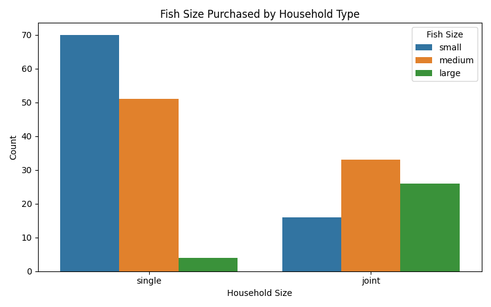

# 🐟 Fish Market Consumer Behavior Analysis
Statistical Analysis & Consumer Insights using Python, ANOVA, and Chi-Square

---

## 📖 Project Overview
This project explores **consumer behavior patterns in fish markets** using a dataset of **200 entries**.  
Unlike guided projects, this dataset was provided without instructions. I independently designed research questions, applied statistical tests, and uncovered insights.  

The project demonstrates:
- **Data Cleaning & Preparation** (Pandas)
- **Exploratory Data Analysis** (grouping, summarization)
- **Statistical Testing** (ANOVA, Chi-Square)
- **Visualization** (Seaborn, Matplotlib)
- **Interpretation of Results** into actionable insights

---

## 🧠 Core Objectives
- Identify fish type preferences across **age groups**
- Analyze how **education level** influences buying reasons
- Explore household structure impact on **fish size preference**
- Assess **socioeconomic status (SES)** effect on fish size and buying frequency
- Test whether **age differences** exist across fish size preferences

---

## 🛠 Tools & Technologies
- **Python**  
- **Pandas** (Data Cleaning & Grouping)  
- **Seaborn & Matplotlib** (Visualization)  
- **SciPy** (ANOVA & Chi-Square Tests)  

---

## 📂 Dataset Structure
### Fish_Market_Dataset.xlsx
Contains:
- Customer demographics (Age, Gender, Occupation, Education, SES, Household type)  
- Buying behavior (Fish type, Fish size, Frequency, Reason for buying)  
- Market type (Local)  

📌 Records: **200 Customers**

---

## 📊 Statistical Results Snapshot

| Test                                | Statistic | p-value | Conclusion              |
|-------------------------------------|-----------|---------|-------------------------|
| ANOVA: Age vs Fish Size             | F=3.34    | 0.0375  | ✅ Significant           |
| Chi-Square: Age Group vs Fish Type  | χ²=19.97  | 0.1731  | ❌ Not Significant       |
| Chi-Square: Education vs Reason     | χ²=27.7   | 0.0061  | ✅ Significant           |
| Chi-Square: Household vs Fish Size  | χ²=44.16  | 0.000   | ✅ Significant           |
| Chi-Square: SES vs Fish Size        | χ²=78.28  | 0.000   | ✅ Significant           |
| Chi-Square: SES vs Frequency        | χ²=23.67  | 0.0026  | ✅ Significant           |

---

## 📸 Project Visualizations
- **Reason for Buying Fish by Education Level**  
- **Fish Size Preference by Household Type**   
- **Fish Type Preference by Age Group**   
- **Results Snapshot Table**  

---

## 🔍 Key Insights
- 🎓 Education significantly influences buying reasons (Nutrition vs Taste).  
- 🏠 Household type strongly affects fish size preference (Joint → Large, Single → Small/Medium).  
- 💰 SES impacts both fish size and buying frequency.  
- 👥 Age differences exist in fish size preference (ANOVA significant).  
- 🐟 Fish type preference by age group shows patterns but not statistically significant.  

---

## 🚀 Recommendations
- Target **health-focused campaigns** for educated consumers.  
- Offer **larger fish sizes** in areas with joint families.  
- Align **pricing and packaging** with socioeconomic segments.  
- Consider **age-based product bundling** for fish size preferences.  

---

## 📌 Project Status
✔ Dataset Provided (200 entries)  
✔ Data Cleaning & Preparation  
✔ Statistical Analysis (ANOVA & Chi-Square)  
✔ Visualization Completed  
✔ Insights & Recommendations Documented  

---

## ✨ Author
**Created by:** Junaid Khan  

Python | Data Analysis | Research Automation | Statistical Testing | Visualization  

---

## ⭐ Support
If you find this project helpful, consider giving it a ⭐ to support my work.
